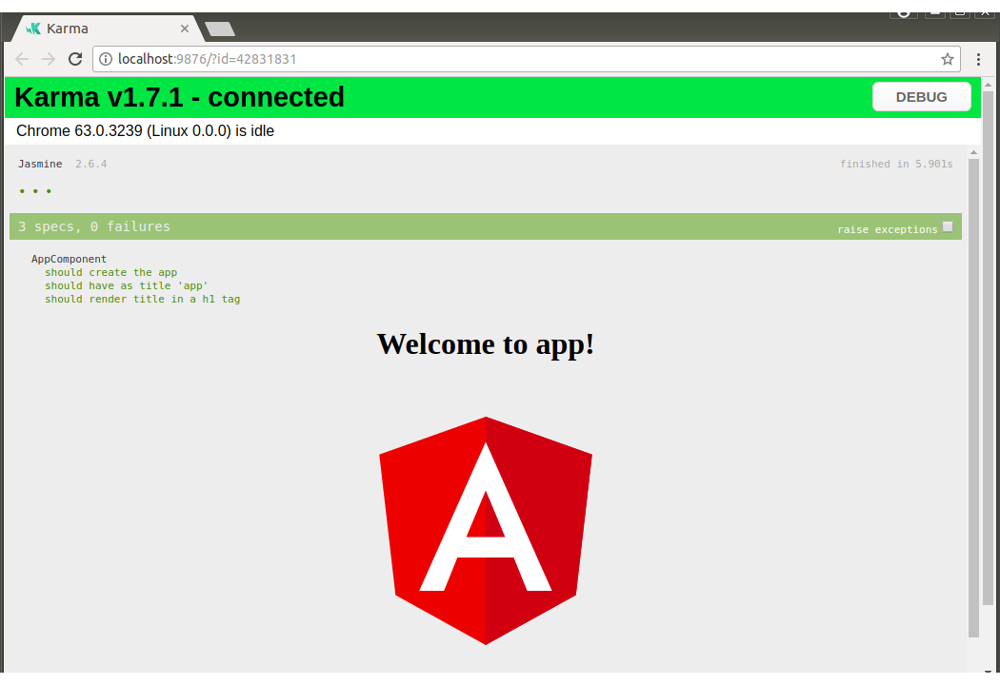
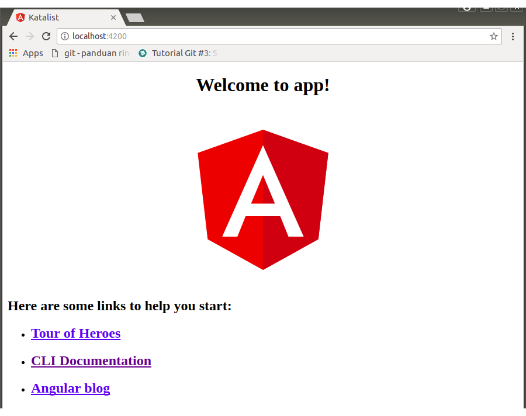
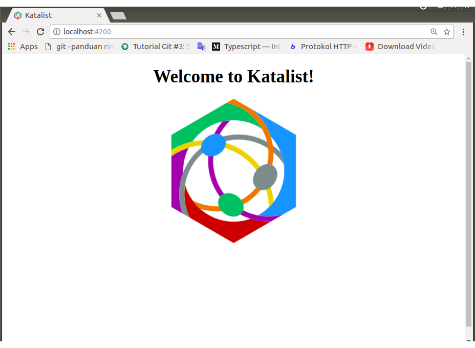
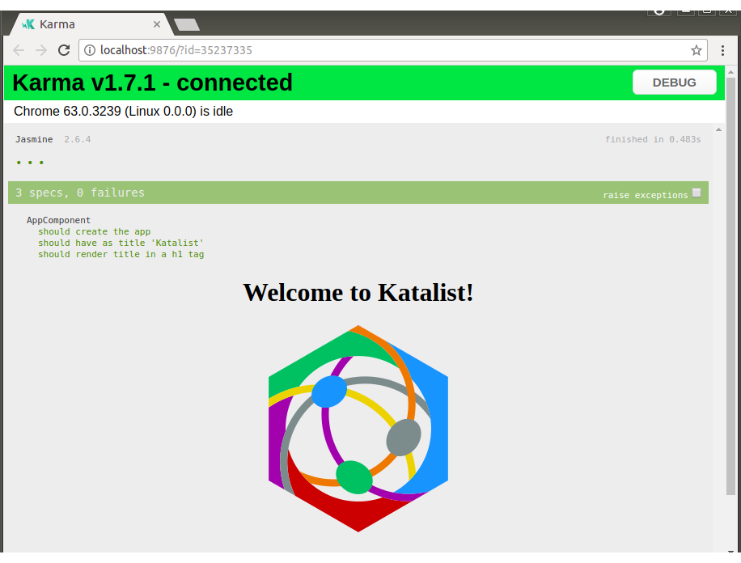

# 0018-project-seeds

DESIGN

1. Create a new project based on Angular 4 called `katalist`.

2. The original basic structure of Anggular Seed is modified to `Katalist's Project Seed`. the visual elements of the main module (`app.module`) and the main component (app.component) are changed to fit the theme of the` katalist` project and named in sync with the function.

IMPLEMENTATION I: Creating a Default Project Seed

1. I work based on guides from the official website of ng4 (https://cli.angular.io/) who referred the documentation to https://github.com/angular/angular-cli/wiki.

    Go to the / AA-C directory, then the catalist directory that was previously used to trial git, was deleted first.

        $   rm -rf katalist

    Then start creating new project,

        $   cd /home/wandyatmono/projects/AA-C/
        $   ng new katalist

    The command then generates the following files,

        create katalist/README.md (1024 bytes)
        create katalist/.angular-cli.json (1243 bytes)
        create katalist/.editorconfig (245 bytes)
        create katalist/.gitignore (516 bytes)
        create katalist/src/assets/.gitkeep (0 bytes)
        create katalist/src/environments/environment.prod.ts (51 bytes)
        create katalist/src/environments/environment.ts (387 bytes)
        create katalist/src/favicon.ico (5430 bytes)
        create katalist/src/index.html (295 bytes)
        create katalist/src/main.ts (370 bytes)
        create katalist/src/polyfills.ts (2405 bytes)
        create katalist/src/styles.css (80 bytes)
        create katalist/src/test.ts (1085 bytes)
        create katalist/src/tsconfig.app.json (211 bytes)
        create katalist/src/tsconfig.spec.json (304 bytes)
        create katalist/src/typings.d.ts (104 bytes)
        create katalist/e2e/app.e2e-spec.ts (290 bytes)
        create katalist/e2e/app.po.ts (208 bytes)
        create katalist/e2e/tsconfig.e2e.json (235 bytes)
        create katalist/karma.conf.js (923 bytes)
        create katalist/package.json (1320 bytes)
        create katalist/protractor.conf.js (722 bytes)
        create katalist/tsconfig.json (363 bytes)
        create katalist/tslint.json (3040 bytes)
        create katalist/src/app/app.module.ts (316 bytes)
        create katalist/src/app/app.component.css (0 bytes)
        create katalist/src/app/app.component.html (1141 bytes)
        create katalist/src/app/app.component.spec.ts (986 bytes)
        create katalist/src/app/app.component.ts (207 bytes)

    Then automatically,

        Installing packages for tooling via npm.
        npm WARN deprecated nodemailer@2.7.2: All versions below 4.0.1 of Nodemailer are deprecated. See https://nodemailer.com/status/
        npm WARN deprecated node-uuid@1.4.8: Use uuid module instead

        > uws@0.14.5 install /home/wandyatmono/projects/AA-C/katalist/node_modules/uws
        > node-gyp rebuild > build_log.txt 2>&1 || exit 0


        > node-sass@4.7.2 install /home/wandyatmono/projects/AA-C/katalist/node_modules/node-sass
        > node scripts/install.js

        Cached binary found at /home/wandyatmono/.npm/node-sass/4.7.2/linux-x64-59_binding.node

        > uglifyjs-webpack-plugin@0.4.6 postinstall /home/wandyatmono/projects/AA-C/katalist/node_modules/webpack/node_modules/uglifyjs-webpack-plugin
        > node lib/post_install.js


        > node-sass@4.7.2 postinstall /home/wandyatmono/projects/AA-C/katalist/node_modules/node-sass
        > node scripts/build.js

        Binary found at /home/wandyatmono/projects/AA-C/katalist/node_modules/node-sass/vendor/linux-x64-59/binding.node
        Testing binary
        Binary is fine
        npm WARN optional SKIPPING OPTIONAL DEPENDENCY: fsevents@1.1.3 (node_modules/fsevents):
        npm WARN notsup SKIPPING OPTIONAL DEPENDENCY: Unsupported platform for fsevents@1.1.3: wanted {"os":"darwin","arch":"any"} (current: {"os":"linux","arch":"x64"})

        added 1453 packages in 166.67s
        Installed packages for tooling via npm.
        Successfully initialized git.
        Project 'katalist' successfully created.

    Hopefully the WARN shown does not interfere with the next development effort. On `ng new` this result is different from during practice. For example there are differences in the number of packages. Last only 1168 packages.

2. Move the previously created `/AA-C/docs` directory (since the OS installation to date) to `/AA-C/katalist`. Then start working with vs-code.

3. Check the seed and karma test.

        $   ng test
        10% building modules 3/4 modules 1 active ...jects/AA-C/katalist/src /\.spec\.ts$/02 02 2018 02:38:52.796:WARN [karma]: No captured browser, open http://localhost:9876/
        02 02 2018 02:38:52.808:INFO [karma]: Front-end scripts not present. Compiling...
        02 02 2018 02:39:01.491:WARN [karma]: No captured browser, open http://localhost:9876/  
        02 02 2018 02:39:02.318:INFO [karma]: Karma v2.0.0 server started at http://0.0.0.0:9876/
        02 02 2018 02:39:02.319:INFO [launcher]: Launching browser Chrome with unlimited concurrency
        02 02 2018 02:39:02.339:INFO [launcher]: Starting browser Chrome
        02 02 2018 02:39:11.827:INFO [Chrome 63.0.3239 (Linux 0.0.0)]: Connected on socket 7u7YbbTl2ld-FkQjAAAA with id 66019908
        Chrome 63.0.3239 (Linux 0.0.0): Executed 3 of 3 SUCCESS (0.423 secs / 0.387 secs)

    Viewed from the browser opened automatically by ng,

    [](./images/0018-1.png)<br>
    <center><i>Figure 0018-1: Test result screenshot</i></center>

4. Tried to run.

        $   cd katalist
        $   ng -v
            _                      _                 ____ _     ___
           / \   _ __   __ _ _   _| | __ _ _ __     / ___| |   |_ _|
          / △ \ | '_ \ / _` | | | | |/ _` | '__|   | |   | |    | |
         / ___ \| | | | (_| | |_| | | (_| | |      | |___| |___ | |
        /_/   \_\_| |_|\__, |\__,_|_|\__,_|_|       \____|_____|___|
                       |___/
            
        Angular CLI: 1.6.7
        Node: 9.3.0
        OS: linux x64
        Angular: 5.2.3
        ... animations, common, compiler, compiler-cli, core, forms
        ... http, language-service, platform-browser
        ... platform-browser-dynamic, router

        @angular/cli: 1.6.7
        @angular-devkit/build-optimizer: 0.0.42
        @angular-devkit/core: 0.0.29
        @angular-devkit/schematics: 0.0.52
        @ngtools/json-schema: 1.1.0
        @ngtools/webpack: 1.9.7
        @schematics/angular: 0.1.17
        typescript: 2.5.3
        webpack: 3.10.0

        $   ng serve
        ** NG Live Development Server is listening on localhost:4200, open your browser on http://localhost:4200/ **
        Date: 2018-02-01T19:48:54.058Z                                                          
        Hash: 8ac4dcf4b710148d4243
        Time: 17274ms
        chunk {inline} inline.bundle.js (inline) 5.79 kB [entry] [rendered]
        chunk {main} main.bundle.js (main) 19.6 kB [initial] [rendered]
        chunk {polyfills} polyfills.bundle.js (polyfills) 554 kB [initial] [rendered]
        chunk {styles} styles.bundle.js (styles) 33.9 kB [initial] [rendered]
        chunk {vendor} vendor.bundle.js (vendor) 7.41 MB [initial] [rendered]

    Making Angular project seeds succeed!. The browser will display as follows.

    [](./images/0018-2.png)<br>
    <center><i>Figure 0018-2: Seen at browser</i></center>

IMPLEMENTATION II: Creating Katalist's Project Seed

1. Initialize git to the project.

    Actually angular-cli has made this new project as a local git-repository when the command `ng new` is given. And even, angular-cli has made `.gitignore` files in great detail and meticulous. So there is no need for re-initialization

2. Setting up a new directory for artworks and assets directory.

    A special directory for processing images named with `/artworks`, is placed in the parent directory (` /AA-C`), where the root of the `/katalist` directory is located. `/artworks` will be `secured` by being stored in https://mega.nz.
    
        /AA-C/artworks

    The catalist project is in `/artworks/katalist`.

    In the `/ assets` directory, the following directories are prepared.

        /src/assets/auxiliaries
        /src/assets/fonts
        /src/assets/images
    
    `/auxliaries` auxliaries is used to store plugins that are still vanilla JS.

    `/fonts` is used to store special fonts (such as `Google's material-icons`).

    `/images` is used to store all images referenced by the application.

3. The Katalist requires a responsive favicon. Compatible when used in different environments. For that reason then in `/ artworks` created some images for that purpose (`/artworks/katalist/favicons/...`). The result is a variety of image sizes placed into `/src/assets/images/favicons`.

4. Delete the .angular-cli.json metadata that configures the favicons.

    ```json
    ...
    "apps": [
        {
            ...
            "assets": [
    (-)         "assets",
    (+)         "assets"
    (-)         "favicon.ico"
            ],
            ...
        }
    ], 
    ...
    ```

5. `src/index.html`, path-link for the favicon, redirected to the appropriate position and into multiple paths as shown below.

    ```html
    <!doctype html>
    <html lang="en">
        <head>
            <meta charset="utf-8">
            <title>Katalist</title>
            <base href="/">

            <meta name="viewport" content="width=device-width, initial-scale=1">
            <link rel='shortcut icon' href='./assets/images/favicons/16.png'>
            <link rel='shortcut icon' href='./assets/images/favicons/16.ico'>
            <link rel='apple-touch-icon' sizes='60x60' href='./assets/images/favicons/60.png'>
            <link rel='apple-touch-icon' sizes='76x76' href='./assets/images/favicons/76.png'>
            <link rel='apple-touch-icon' sizes='120x120' href='./assets/images/favicons/120.png'>
            <link rel='apple-touch-icon' sizes='152x152' href='./assets/images/favicons/152.png'>
        </head>
        <body>
            <app-root>Loading ...</app-root>
        </body>
    </html>
    ```
    Thus `/src/favicons.ico` in the form of the angular logo is removed, replaced with some images copied from its artworks.

        ./assets/images/favicons/16.png
        ./assets/images/favicons/16.ico
        ./assets/images/favicons/60.png
        ./assets/images/favicons/76.png
        ./assets/images/favicons/120.png
        ./assets/images/favicons/152.png

6. The 'Loading ...' access process indicator inside <app-root> ... </ app-root> (in `app.component.html`) is modified to be more catchie so index.html will become,

    ```html
    <!doctype html>
    <html lang="en">
        <head>
            <meta charset="utf-8">
            <title>Katalist</title>
            <base href="/">

            <meta name="viewport" content="width=device-width, initial-scale=1">
            <link rel='shortcut icon' href='./assets/images/favicons/16.png'>
            <link rel='shortcut icon' href='./assets/images/favicons/16.ico'>
            <link rel='apple-touch-icon' sizes='60x60' href='./assets/images/favicons/60.png'>
            <link rel='apple-touch-icon' sizes='76x76' href='./assets/images/favicons/76.png'>
            <link rel='apple-touch-icon' sizes='120x120' href='./assets/images/favicons/120.png'>
            <link rel='apple-touch-icon' sizes='152x152' href='./assets/images/favicons/152.png'>

            <!-- inline spinner styles to be able to display spinner right away -->
            <style type="text/css">
            body, html {
                height: 100%;
                margin: 0;
            }
            .app-loading {
                position: relative;
                display: flex;
                flex-direction: column;
                align-items: center;
                justify-content: center;
                height: 100%;
            }
            .app-loading .splash {
                height: 100%; width: 100%;
                background-image: url(./assets/images/splash/herman-damar/village-life-indonesia-herman-damar-18.jpg);
                background-size: cover;
                background-position: bottom center;
                background-repeat: no-repeat;
                position: absolute;
            }
            .app-loading .logo {
                width: 100px;
                height: 100px;
                background: url(./assets/images/favicons/60.png) center center no-repeat; 
                position: absolute;
            }
            .app-loading .spinner {
                height: 200px;
                width: 200px;
                animation: rotate 2s linear infinite;
                transform-origin: center center;
                position: absolute;
                top: 0;
                bottom: 0;
                left: 0;
                right: 0;
                margin: auto;
            }
            .app-loading .spinner .path {
                stroke-dasharray: 1, 200;
                stroke-dashoffset: 0;
                animation: dash 1.5s ease-in-out infinite;
                stroke-linecap: round;
                stroke: #ddd;
            }
            @keyframes rotate {
                100% {
                transform: rotate(360deg);
                }
            }
            @keyframes dash {
                0% {
                stroke-dasharray: 1, 200;
                stroke-dashoffset: 0;
                }
                50% {
                stroke-dasharray: 89, 200;
                stroke-dashoffset: -35px;
                }
                100% {
                stroke-dasharray: 89, 200;
                stroke-dashoffset: -124px;
                }
            }
            </style>
        </head>
        <body>
            <app-root>
                <!-- loading layout replaced by app after startupp -->
                <div class="app-loading">
                    <div class="splash"></div>
                    <div class="logo"></div>
                    <svg class="spinner" viewBox="25 25 50 50">
                    <circle class="path" cx="50" cy="50" r="20" fill="none" stroke-width="2" stroke-miterlimit="10"/>
                    </svg>
                </div>
            </app-root>
        </body>
    </html>
    ```

    `Notes:`
    When the app starts, due to additional styles and markups above, the workspace will display a photo of the work of `Herman Damar` which I have previously downloaded and placed in` ./assets/images/splash/herman-damar/village-life- indonesia-herman-damar-18.jpg`.
    Spinner created with css. When it appears it will move around the catalyst logo taken from the favicons directory (`./assets/images/favicons/60.png`).

    The screenshot looks like this:

    [](./images/0018-3.png)<br>
    <center><i>Figure 0018-3: Splash</i></center>


IMPLEMENTATION III: Changing the Basic Structure

The catalist makes `app.module` the root of all modules and other components, hence its name is changed to` root.module`. Similarly app.component, its name is changed to `root.component`

1. `app.component` to` root.component`

    `app.component.ts` > `root.component.ts`

    ```javascript
    import { Component } from '@angular/core';

    @Component({
        selector: 'app-root',
        templateUrl: './root.component.html',
        styleUrls: ['./root.component.css']
    })
    export class RootComponent {
        title = 'Katalist';
    }
    ```

2. `app.component.html` > `root.component.html`

    ```html
    <!--The content below is only a placeholder and can be replaced.-->
    <div style="text-align:center">
        <h1>
            Welcome to {{ title }}!
        </h1>
        
    </div>
    ```

    Through the process in `/artworks`,  new images are placed in `/images` which is `/favicons/256.png`

3. `app.component.css` just renamed to `root.component.css`

4. `app.module.ts` > `root.module.ts`

    ```javascript
    import { BrowserModule } from '@angular/platform-browser';
    import { NgModule } from '@angular/core';


    import { RootComponent } from './root.component';


    @NgModule({
    declarations: [
        RootComponent
    ],
    imports: [
        BrowserModule
    ],
    providers: [],
    bootstrap: [RootComponent]
    })
    export class RootModule { }
    ```

5. Update `main.ts`

    ```javascript
    import { enableProdMode } from '@angular/core';
    import { platformBrowserDynamic } from '@angular/platform-browser-dynamic';

    import { RootModule } from './app/root.module';
    import { environment } from './environments/environment';

    if (environment.production) {
    enableProdMode();
    }

    platformBrowserDynamic().bootstrapModule(RootModule)
    .catch(err => console.log(err));
    ```

6. `/app.component.spec.ts` > `/root.component.spec.ts`

    ```javascript
    import { TestBed, async } from '@angular/core/testing';
    import { RootComponent } from './root.component';
    describe('AppComponent', () => {
        beforeEach(async(() => {
            TestBed.configureTestingModule({
                declarations: [
                    RootComponent
                ],
            }).compileComponents();
        }));
        it('should create the app', async(() => {
            const fixture = TestBed.createComponent(RootComponent);
            const app = fixture.debugElement.componentInstance;
            expect(app).toBeTruthy();
        }));
        it(`should have as title 'Katalist'`, async(() => {
            const fixture = TestBed.createComponent(RootComponent);
            const app = fixture.debugElement.componentInstance;
            expect(app.title).toEqual('Katalist');
        }));
        it('should render title in a h1 tag', async(() => {
            const fixture = TestBed.createComponent(RootComponent);
            fixture.detectChanges();
            const compiled = fixture.debugElement.nativeElement;
            expect(compiled.querySelector('h1').textContent).toContain('Welcome to Katalist');
        }));
    });
    ```

7. Result in browser

    [](./images/0018-4.png)<br>
    <center><i>Figure 0018-4: Project seed</i></center>

8. Adding new and modified files to git-stage

    After all checked. All files are added to the stage and can be committed.

        $   git add .
        $   git commit -m "Katalist's Project Seed"

9. Test!.

        $   ng test
        10% building modules 1/1 modules 0 active30 01 2018 07:31:23.931:WARN [karma]: No captured browser, open http://localhost:9876/
        30 01 2018 07:31:23.990:INFO [karma]: Karma v1.7.1 server started at http://0.0.0.0:9876/
        30 01 2018 07:31:23.993:INFO [launcher]: Launching browser Chrome with unlimited concurrency
        30 01 2018 07:31:24.014:INFO [launcher]: Starting browser Chrome
        30 01 2018 07:31:48.288:WARN [karma]: No captured browser, open http://localhost:9876/  
        30 01 2018 07:31:49.287:INFO [Chrome 63.0.3239 (Linux 0.0.0)]: Connected on socket J57OLZZzQypTR-WOAAAA with id 86042912
        Chrome 63.0.3239 (Linux 0.0.0): Executed 3 of 3 SUCCESS (0.266 secs / 0.243 secs)

    [](./images/0018-5.png)<br>
    <center><i>Figure 0018-5: Test result screenshot</i></center>

