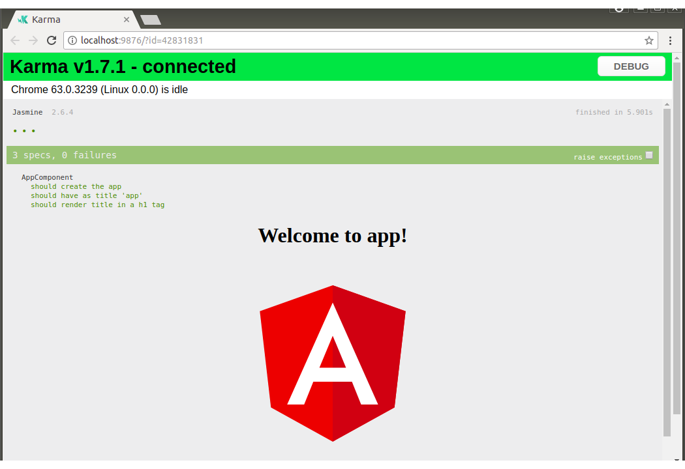
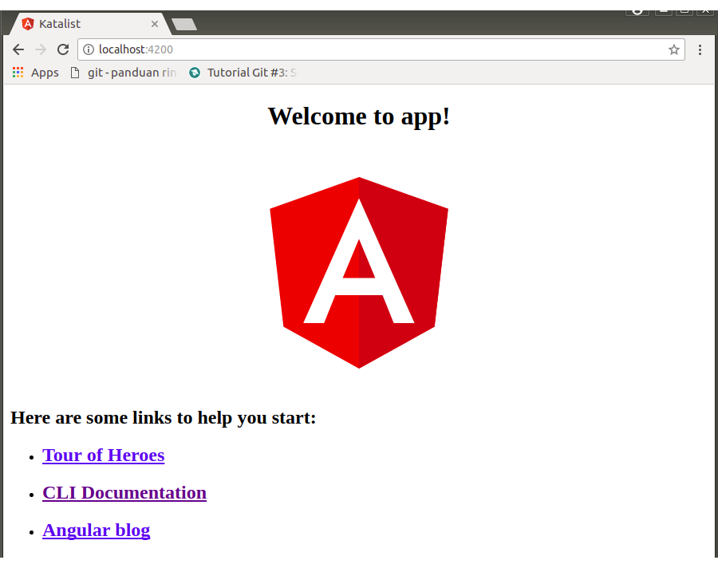
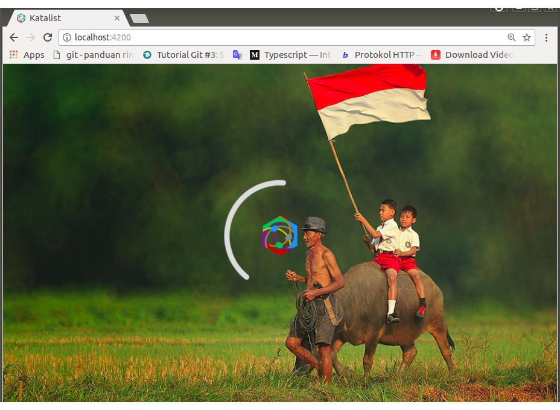
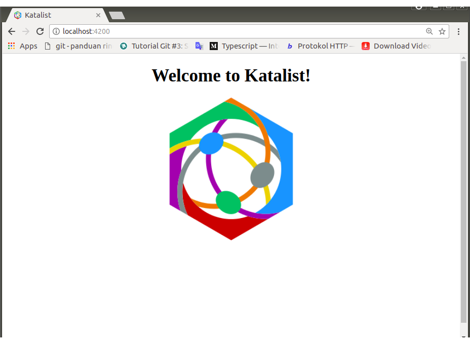
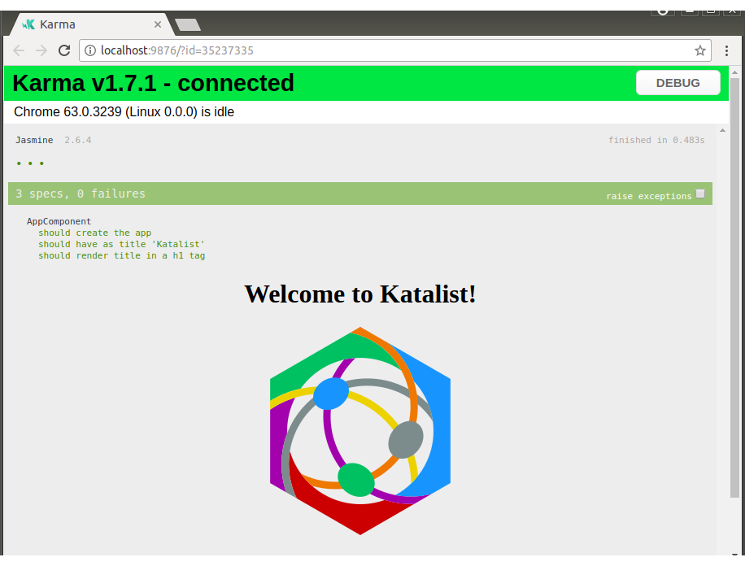

# 0018-project-seeds

DESAIN

1. Membuat project baru berbasis Angular 4 bernama `katalist`.

2. Struktur dasar asli Anggular Seed dimodifikasi menjadi `Katalist's Project Seed`. element-element visual dari module utama (`app.module`) dan component utama (app.component) dirubah agar sesuai dengan thema proyek `katalist` dan dinamai agar sinkron dengan fungsinya.

IMPLEMENTASI I: Membuat Default Project Seed

1. Saya bekerja berdasarkan panduan dari situs resmi dari ng4 (https://cli.angular.io/) yang merujukkan dokumentasinya ke https://github.com/angular/angular-cli/wiki.

    Masuk ke direktori /AA-C, kemudian direktori /katalist yang sebelumnya digunakan untuk coba-coba git, dihapus terlebih dahulu.

        $   rm -rf katalist

    Kemudian mulai buat project baru,

        $   cd /home/wandyatmono/projects/AA-C/
        $   ng new katalist

    Komando tersebut akan menghasilkan file-file berikut ini,

        create katalist/README.md (1024 bytes)
        create katalist/.angular-cli.json (1243 bytes)
        create katalist/.editorconfig (245 bytes)
        create katalist/.gitignore (516 bytes)
        create katalist/src/assets/.gitkeep (0 bytes)
        create katalist/src/environments/environment.prod.ts (51 bytes)
        create katalist/src/environments/environment.ts (387 bytes)
        create katalist/src/favicon.ico (5430 bytes)
        create katalist/src/index.html (295 bytes)
        create katalist/src/main.ts (370 bytes)
        create katalist/src/polyfills.ts (2405 bytes)
        create katalist/src/styles.css (80 bytes)
        create katalist/src/test.ts (1085 bytes)
        create katalist/src/tsconfig.app.json (211 bytes)
        create katalist/src/tsconfig.spec.json (304 bytes)
        create katalist/src/typings.d.ts (104 bytes)
        create katalist/e2e/app.e2e-spec.ts (290 bytes)
        create katalist/e2e/app.po.ts (208 bytes)
        create katalist/e2e/tsconfig.e2e.json (235 bytes)
        create katalist/karma.conf.js (923 bytes)
        create katalist/package.json (1320 bytes)
        create katalist/protractor.conf.js (722 bytes)
        create katalist/tsconfig.json (363 bytes)
        create katalist/tslint.json (3040 bytes)
        create katalist/src/app/app.module.ts (316 bytes)
        create katalist/src/app/app.component.css (0 bytes)
        create katalist/src/app/app.component.html (1141 bytes)
        create katalist/src/app/app.component.spec.ts (986 bytes)
        create katalist/src/app/app.component.ts (207 bytes)
 
    Kemudian secara automatis,

        Installing packages for tooling via npm.
        npm WARN deprecated nodemailer@2.7.2: All versions below 4.0.1 of Nodemailer are deprecated. See https://nodemailer.com/status/
        npm WARN deprecated node-uuid@1.4.8: Use uuid module instead

        > uws@0.14.5 install /home/wandyatmono/projects/AA-C/katalist/node_modules/uws
        > node-gyp rebuild > build_log.txt 2>&1 || exit 0


        > node-sass@4.7.2 install /home/wandyatmono/projects/AA-C/katalist/node_modules/node-sass
        > node scripts/install.js

        Cached binary found at /home/wandyatmono/.npm/node-sass/4.7.2/linux-x64-59_binding.node

        > uglifyjs-webpack-plugin@0.4.6 postinstall /home/wandyatmono/projects/AA-C/katalist/node_modules/webpack/node_modules/uglifyjs-webpack-plugin
        > node lib/post_install.js


        > node-sass@4.7.2 postinstall /home/wandyatmono/projects/AA-C/katalist/node_modules/node-sass
        > node scripts/build.js

        Binary found at /home/wandyatmono/projects/AA-C/katalist/node_modules/node-sass/vendor/linux-x64-59/binding.node
        Testing binary
        Binary is fine
        npm WARN optional SKIPPING OPTIONAL DEPENDENCY: fsevents@1.1.3 (node_modules/fsevents):
        npm WARN notsup SKIPPING OPTIONAL DEPENDENCY: Unsupported platform for fsevents@1.1.3: wanted {"os":"darwin","arch":"any"} (current: {"os":"linux","arch":"x64"})

        added 1453 packages in 166.67s
        Installed packages for tooling via npm.
        Successfully initialized git.
        Project 'katalist' successfully created.

    Mudah-mudahan WARN yang ditampilkan tidak mengganggu upaya pengembangan berikutnya. Pada `ng new` ini hasilnya berbeda dengan saat latihan. Contohnya adanya perbedaan jumlah package. Terakhir hanya sejumlah 1168 packages.

2.  Pindahkan direktori `/AA-C/docs` yang sebelumnya telah dibuat (sejak instalasi OS sampai saat ini) ke `/AA-C/katalist`. Kemudian mulailah bekerja dengan vs-code.

3.  Memeriksa seed dan karma test.

        $   ng test
        10% building modules 3/4 modules 1 active ...jects/AA-C/katalist/src /\.spec\.ts$/02 02 2018 02:38:52.796:WARN [karma]: No captured browser, open http://localhost:9876/
        02 02 2018 02:38:52.808:INFO [karma]: Front-end scripts not present. Compiling...
        02 02 2018 02:39:01.491:WARN [karma]: No captured browser, open http://localhost:9876/  
        02 02 2018 02:39:02.318:INFO [karma]: Karma v2.0.0 server started at http://0.0.0.0:9876/
        02 02 2018 02:39:02.319:INFO [launcher]: Launching browser Chrome with unlimited concurrency
        02 02 2018 02:39:02.339:INFO [launcher]: Starting browser Chrome
        02 02 2018 02:39:11.827:INFO [Chrome 63.0.3239 (Linux 0.0.0)]: Connected on socket 7u7YbbTl2ld-FkQjAAAA with id 66019908
        Chrome 63.0.3239 (Linux 0.0.0): Executed 3 of 3 SUCCESS (0.423 secs / 0.387 secs)

    Dilihat dari browser yang dibuka secara otomatis oleh ng,

    [](./images/0018-1.png)<br>
    <center><i>Gambar 0018-1: Screenshot hasil test</i></center>

4.  Dicoba dijalankan.

        $   cd katalist
        $   ng -v
            _                      _                 ____ _     ___
           / \   _ __   __ _ _   _| | __ _ _ __     / ___| |   |_ _|
          / △ \ | '_ \ / _` | | | | |/ _` | '__|   | |   | |    | |
         / ___ \| | | | (_| | |_| | | (_| | |      | |___| |___ | |
        /_/   \_\_| |_|\__, |\__,_|_|\__,_|_|       \____|_____|___|
                       |___/
            
        Angular CLI: 1.6.7
        Node: 9.3.0
        OS: linux x64
        Angular: 5.2.3
        ... animations, common, compiler, compiler-cli, core, forms
        ... http, language-service, platform-browser
        ... platform-browser-dynamic, router

        @angular/cli: 1.6.7
        @angular-devkit/build-optimizer: 0.0.42
        @angular-devkit/core: 0.0.29
        @angular-devkit/schematics: 0.0.52
        @ngtools/json-schema: 1.1.0
        @ngtools/webpack: 1.9.7
        @schematics/angular: 0.1.17
        typescript: 2.5.3
        webpack: 3.10.0

        $   ng serve
        ** NG Live Development Server is listening on localhost:4200, open your browser on http://localhost:4200/ **
        Date: 2018-02-01T19:48:54.058Z                                                          
        Hash: 8ac4dcf4b710148d4243
        Time: 17274ms
        chunk {inline} inline.bundle.js (inline) 5.79 kB [entry] [rendered]
        chunk {main} main.bundle.js (main) 19.6 kB [initial] [rendered]
        chunk {polyfills} polyfills.bundle.js (polyfills) 554 kB [initial] [rendered]
        chunk {styles} styles.bundle.js (styles) 33.9 kB [initial] [rendered]
        chunk {vendor} vendor.bundle.js (vendor) 7.41 MB [initial] [rendered]


    Pembuatan Angular project seed berhasil!. Browser akan menampilkan seperti berikut ini.

    [](./images/0018-2.png)<br>
    <center><i>Gambar 0018-2: Tampak di browser</i></center>


IMPLEMENTASI II: Membuat Katalist's Project Seed

1. Inisialiasi git ke proyek.

    Sebenarnya angular-cli sudah menjadikan proyek baru ini sebagai git-repository lokal ketika komando `ng new` diberikan. Dan bahkan, angular-cli telah membuatkan file `.gitignore` dengan sangat rinci dan teliti. Sehingga tidak perlu ada inisialisasi ulang

2. Menyiapkan direktori baru untuk artworks dan direktori assets.

    Direktori khusus untuk memproses images dinamai dengan `/artworks`, diletakkan di direktori induk (`/AA-C`), tempat root direktori  `/katalist` berada. `/artworks` akan `diamankan` dengan disimpan di https://mega.nz.
    
        /AA-C/artworks

    Proyek katalist berada di `/artworks/katalist`. 

    Di dalam direktori `/assets`, disiapkan direktori-direktori berikut ini. 

        /src/assets/auxiliaries
        /src/assets/fonts
        /src/assets/images
    
    `/auxliaries` digunakan untuk menyimpan plugin yang masih berupa vanila JS.

    `/fonts` digunakan untuk menyimpan fonts khusus (seperti misalnya `Google's material-icons`).

    `/images` digunakan untuk menyimpan semua images yang dirujuk oleh aplikasi.

3.  Katalist menghendaki adanya favicon yang responsive. Kompatibel saat digunakan diberbagai lingkungan. Untuk alasan itu maka di `/artworks/katalist/favicons` diproses beberapa images untuk kepentingan tersebut. Hasilnya yang terdiri dari berbagai ukuran images di letakkan ke dalam `/src/assets/images/favicons`.

4. Menghapus metadata .angular-cli.json yang mengkonfigurasikan favicons.

    ```json
    ...
    "apps": [
        {
            ...
            "assets": [
    (-)         "assets",
    (+)         "assets"
    (-)         "favicon.ico"
            ],
            ...
        }
    ], 
    ...
    ```

5. `src/index.html`, path-link untuk favicon, dialihkan ke posisi yang sesuai dan karena merujuk ke beberapa images, path-link ke favicon menjadi tidak hanya satu.

    ```html
    <!doctype html>
    <html lang="en">
        <head>
            <meta charset="utf-8">
            <title>Katalist</title>
            <base href="/">

            <meta name="viewport" content="width=device-width, initial-scale=1">
            <link rel='shortcut icon' href='./assets/images/favicons/16.png'>
            <link rel='shortcut icon' href='./assets/images/favicons/16.ico'>
            <link rel='apple-touch-icon' sizes='60x60' href='./assets/images/favicons/60.png'>
            <link rel='apple-touch-icon' sizes='76x76' href='./assets/images/favicons/76.png'>
            <link rel='apple-touch-icon' sizes='120x120' href='./assets/images/favicons/120.png'>
            <link rel='apple-touch-icon' sizes='152x152' href='./assets/images/favicons/152.png'>
        </head>
        <body>
            <app-root>Loading ...</app-root>
        </body>
    </html>
    ```

    Dengan demikian `/src/favicons.ico` yang berupa logo angular dihapus, diganti dengan beberapa images yang disalin dari artworks-nya.

        ./assets/images/favicons/16.png
        ./assets/images/favicons/16.ico
        ./assets/images/favicons/60.png
        ./assets/images/favicons/76.png
        ./assets/images/favicons/120.png
        ./assets/images/favicons/152.png

6. Indikator proses pengaksesan `Loading ...` yang berada di dalam `<app-root>...</app-root>` (di `app.component.html`) dimodifikasi menjadi lebih catchie sehingga index.html akan menjadi,

    ```html
    <!doctype html>
    <html lang="en">
        <head>
            <meta charset="utf-8">
            <title>Katalist</title>
            <base href="/">

            <meta name="viewport" content="width=device-width, initial-scale=1">
            <link rel='shortcut icon' href='./assets/images/favicons/16.png'>
            <link rel='shortcut icon' href='./assets/images/favicons/16.ico'>
            <link rel='apple-touch-icon' sizes='60x60' href='./assets/images/favicons/60.png'>
            <link rel='apple-touch-icon' sizes='76x76' href='./assets/images/favicons/76.png'>
            <link rel='apple-touch-icon' sizes='120x120' href='./assets/images/favicons/120.png'>
            <link rel='apple-touch-icon' sizes='152x152' href='./assets/images/favicons/152.png'>

            <!-- inline spinner styles to be able to display spinner right away -->
            <style type="text/css">
            body, html {
                height: 100%;
                margin: 0;
            }
            .app-loading {
                position: relative;
                display: flex;
                flex-direction: column;
                align-items: center;
                justify-content: center;
                height: 100%;
            }
            .app-loading .splash {
                height: 100%; width: 100%;
                background-image: url(./assets/images/splash/herman-damar/village-life-indonesia-herman-damar-18.jpg);
                background-size: cover;
                background-position: bottom center;
                background-repeat: no-repeat;
                position: absolute;
            }
            .app-loading .logo {
                width: 100px;
                height: 100px;
                background: url(./assets/images/favicons/60.png) center center no-repeat; 
                position: absolute;
            }
            .app-loading .spinner {
                height: 200px;
                width: 200px;
                animation: rotate 2s linear infinite;
                transform-origin: center center;
                position: absolute;
                top: 0;
                bottom: 0;
                left: 0;
                right: 0;
                margin: auto;
            }
            .app-loading .spinner .path {
                stroke-dasharray: 1, 200;
                stroke-dashoffset: 0;
                animation: dash 1.5s ease-in-out infinite;
                stroke-linecap: round;
                stroke: #ddd;
            }
            @keyframes rotate {
                100% {
                transform: rotate(360deg);
                }
            }
            @keyframes dash {
                0% {
                stroke-dasharray: 1, 200;
                stroke-dashoffset: 0;
                }
                50% {
                stroke-dasharray: 89, 200;
                stroke-dashoffset: -35px;
                }
                100% {
                stroke-dasharray: 89, 200;
                stroke-dashoffset: -124px;
                }
            }
            </style>
        </head>
        <body>
            <app-root>
                <!-- loading layout replaced by app after startupp -->
                <div class="app-loading">
                    <div class="splash"></div>
                    <div class="logo"></div>
                    <svg class="spinner" viewBox="25 25 50 50">
                    <circle class="path" cx="50" cy="50" r="20" fill="none" stroke-width="2" stroke-miterlimit="10"/>
                    </svg>
                </div>
            </app-root>
        </body>
    </html>
    ```

    `Catatan:`
    Saat aplikasi dijalankan, karena adanya tambahan styles dan markups di atas, di workspace akan ditampilkan sebuah photo hasil karya `Herman Damar` yang sebelumnya telah saya download dan diletakkan di `./assets/images/splash/herman-damar/village-life-indonesia-herman-damar-18.jpg`.
    Spinner dibuat dengan css. Saat tampil akan bergerak melingkari logo katalist yang diambilkan dari direktori favicons (`./assets/images/favicons/60.png`).

    Screenshotnya seperti ini:

    [](./images/0018-3.png)<br>
    <center><i>Gambar 0018-3: Splash</i></center>


IMPLEMENTASI III: Merubah Struktur Dasar

Katalist menjadikan `app.module` menjadi root dari seluruh module dan components lain, oleh karena itu nama-nya diganti menjadi `root.module`. Demikian pula app.component, namanya diganti menjadi `root.component` 

1. `app.component` menjadi `root.component`

    `app.component.ts` > `root.component.ts`

    ```javascript
    import { Component } from '@angular/core';

    @Component({
        selector: 'app-root',
        templateUrl: './root.component.html',
        styleUrls: ['./root.component.css']
    })
    export class RootComponent {
        title = 'Katalist';
    }
    ```

2. `app.component.html` > `root.component.html`

    ```html
    <!--The content below is only a placeholder and can be replaced.-->
    <div style="text-align:center">
        <h1>
            Welcome to {{ title }}!
        </h1>
        
    </div>
    ```

    Melalui proses di `/artworks`, diletakkan images baru di `/images` yaitu `/favicons/256.png`

3. `app.component.css` hanya dirubah namanya menjadi `root.component.css`

4. `app.module.ts` > `root.module.ts`

    ```javascript
    import { BrowserModule } from '@angular/platform-browser';
    import { NgModule } from '@angular/core';


    import { RootComponent } from './root.component';


    @NgModule({
    declarations: [
        RootComponent
    ],
    imports: [
        BrowserModule
    ],
    providers: [],
    bootstrap: [RootComponent]
    })
    export class RootModule { }
    ```

5. Update `main.ts`

    ```javascript
    import { enableProdMode } from '@angular/core';
    import { platformBrowserDynamic } from '@angular/platform-browser-dynamic';

    import { RootModule } from './app/root.module';
    import { environment } from './environments/environment';

    if (environment.production) {
    enableProdMode();
    }

    platformBrowserDynamic().bootstrapModule(RootModule)
    .catch(err => console.log(err));
    ```

6. `/app.component.spec.ts` > `/root.component.spec.ts`

    ```javascript
    import { TestBed, async } from '@angular/core/testing';
    import { RootComponent } from './root.component';
    describe('AppComponent', () => {
        beforeEach(async(() => {
            TestBed.configureTestingModule({
                declarations: [
                    RootComponent
                ],
            }).compileComponents();
        }));
        it('should create the app', async(() => {
            const fixture = TestBed.createComponent(RootComponent);
            const app = fixture.debugElement.componentInstance;
            expect(app).toBeTruthy();
        }));
        it(`should have as title 'Katalist'`, async(() => {
            const fixture = TestBed.createComponent(RootComponent);
            const app = fixture.debugElement.componentInstance;
            expect(app.title).toEqual('Katalist');
        }));
        it('should render title in a h1 tag', async(() => {
            const fixture = TestBed.createComponent(RootComponent);
            fixture.detectChanges();
            const compiled = fixture.debugElement.nativeElement;
            expect(compiled.querySelector('h1').textContent).toContain('Welcome to Katalist');
        }));
    });
    ```
    
7. Hasil di browser

    [](./images/0018-4.png)<br>
    <center><i>Gambar 0018-4: Project seed</i></center>

8. Menambahkan file baru dan yang telah dimodifikasi ke git-stage

    Setelah semua  diperiksa. Semua file di-add ke stage dan bisa di-commit.

        $   git add .
        $   git commit -m "Katalist's Project Seed"

9. Test!.

        $   ng test
        10% building modules 1/1 modules 0 active30 01 2018 07:31:23.931:WARN [karma]: No captured browser, open http://localhost:9876/
        30 01 2018 07:31:23.990:INFO [karma]: Karma v1.7.1 server started at http://0.0.0.0:9876/
        30 01 2018 07:31:23.993:INFO [launcher]: Launching browser Chrome with unlimited concurrency
        30 01 2018 07:31:24.014:INFO [launcher]: Starting browser Chrome
        30 01 2018 07:31:48.288:WARN [karma]: No captured browser, open http://localhost:9876/  
        30 01 2018 07:31:49.287:INFO [Chrome 63.0.3239 (Linux 0.0.0)]: Connected on socket J57OLZZzQypTR-WOAAAA with id 86042912
        Chrome 63.0.3239 (Linux 0.0.0): Executed 3 of 3 SUCCESS (0.266 secs / 0.243 secs)

    [](./images/0018-5.png)<br>
    <center><i>Gambar 0018-5: Screenshot hasil running test</i></center>

