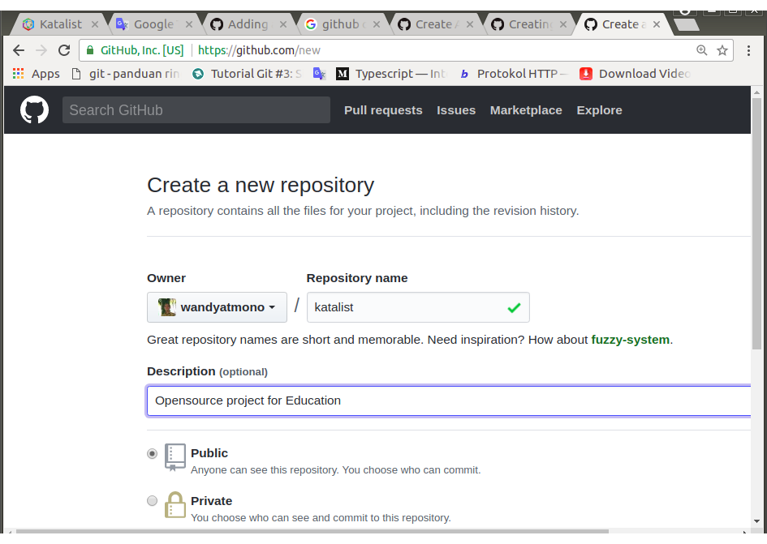
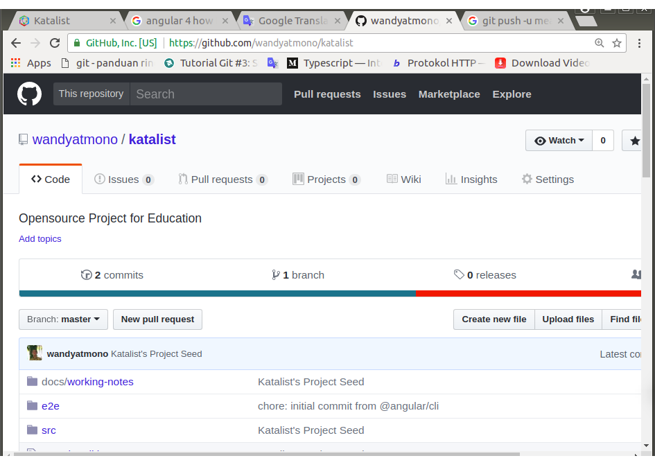

# 0019-push-to-github-repo

### DESAIN

1. Membuat repository di Github.
2. Push local repository ke remote repository

	> `Catatan:`
	> Tentu saja, file dokumentasi nomor 0019 ini tidak dapat dibaca di Github di checkpoint ini. Masih untracked.

### IMPLEMENTASI I: Membuat repository di Github.

1. Signin ke Github dan berada di home-page (sesuai account).

2. Pilih `New repository` di pulldown-menu `**+**` di pojok kanan atas page yang mana saja (atau click tombol `New repository` jika sedang berada di home-page).

3. Masukkan nama proyek Menurut Github, sebaiknya dengan kalimat singkat dan mudah diingat.

    	katalist

	Dan diskripsinya-nya,

		Opensource Project for Education

	Kemudian, click tombol `Create repository` di bagian bawah page.

	> Sebelum `Create repository`, dapat ditentukan apakah repository akan dibuat bersifat `public` atau `private`. Visible terhadap publik atau hanya untuk diri sendiri atau orang tertentu yang kita beri share hak untuk bisa berkontribusi. Untuk pilihan kedua hanya untuk account yang berbayar.
	> Untuk menghindari kesalahan, saya tidak menginisialisasi Github-repo dengan file README, lisensi, atau gitignore. Saya akan menambahkan file-file tersebut setelah push local-repository.

     
    
<i>Gambar 0019-1: Github New Repository Form Page</i>

### IMPLEMENTASI II: Push local repository ke remote repository

1. Setelah repository terbentuk, kita akan dihadapkan dengan beberapa petunjuk. Terutama petunjuk untuk mengkonfiguasi local repo kita dan komando untuk push local repository ke remote repository yang baru saja kita buat.

        $   git remote add origin https://github.com/wandyatmono/katalist.git
        $   git remote -v
        origin	https://github.com/wandyatmono/katalist.git (fetch)
        origin	https://github.com/wandyatmono/katalist.git (push)

2. Push local repository ke remote repository yang sebelumnya telah kita sebutkan sebagai origin di atas.

        $   git push -u origin master
        Username for 'https://github.com': wandyatmono
        Password for 'https://wandyatmono@github.com': 
        Counting objects: 105, done.
        Delta compression using up to 2 threads.
        Compressing objects: 100% (101/101), done.
        Writing objects: 100% (105/105), 1.26 MiB | 48.00 KiB/s, done.
        Total 105 (delta 8), reused 0 (delta 0)
        remote: Resolving deltas: 100% (8/8), done.
        To https://github.com/wandyatmono/katalist.git
        * [new branch]      master -> master
        Branch 'master' set up to track remote branch 'master' from 'origin'.

     
    
<i>Gambar 0019-2: Repositori Katalist</i>

