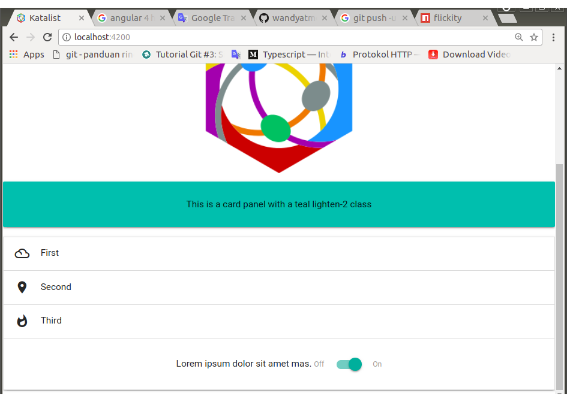

# 0020-materialize-setup


## DESIGN

The katalist must apply the principles of `Google Material Design` when constructing` UX` (`User Experience`).

For that purpose, I decided to use `CSS framework` named` MaterializeCSS` (in this documentation it will be called 'materialize` only). Although Materialize has a dependence on `jQuery`, `HammerJS` and `velocity.js`, I set this framework as my choice. In my opinion, this framework is quite comprehensive, complete documentation, not rigid and easy to use.

## IMPLEMENTATION I: Materialize Installation

1.	I am referring to

	https://github.com/InfomediaLtd/angular2-materialize
	https://www.npmjs.com/package/angular2-materialize

	And it's demo at:

	https://infomedialtd.github.io/angular2-materialize

	The materialize official website itself is on:

	http://materializecss.com

2. Install MaterializeCSS and `angular2-materialize` from npm

	`$	npm install materialize-css --save`<br>
	`$	npm install angular2-materialize --save`


3. Need jQuery 2.2 and Hammer.JS as dependencies

	`$	npm install jquery@^3.3.1 --save`<br>
	`$	npm install @types/jquery --save`<br>
	`$	npm install hammerjs --save`<br>
	`$	npm install @types/hammerjs --save`

	Command 2 and 4 above are used to introduce the corresponding library to typescript.

	> In the instructions, the requested jquery version is ^ 2.4.1 but i decided to replace it with jquery@^3.3.1, because i've tried, if using jquery low version in high angular version, some swipe events can not work properly on mobile device.

4. Edit the angular-cli.json

	- Go to section `apps` and find `styles` array inside it (with only` styles.css` as a default value). I override this default value with the value below and delete `style.css` file.

		`"../node_modules/materialize-css/dist/css/materialize.css"`

	- Go to section `apps` and find `scripts` array inside it, and add the following lines inside array

		`"../node_modules/jquery/dist/jquery.js",`
		`"../node_modules/hammerjs/hammer.js",`
		`"../node_modules/materialize-css/dist/js/materialize.js"`

5. Add to the top of `root.module.ts`

	```javascript
	import { MaterializeModule } from 'angular2-materialize';
	```

6. Add `MaterializeModule` inside `imports` array of `@NgModule` decorator in `root.module.ts`

7. Add this line to header of index.html

	```html
	<link href="http://fonts.googleapis.com/icon?family=Material+Icons" rel="stylesheet">
	```

	For local link:

	```html
	<link rel="stylesheet" href="./assets/fonts/google-2.0.0/material-icons.css">
	```

	> Into /fonts, enter the google-2.0.0 directory by copying it from another project or downloading it with the help of Google Search.

8. Component that will use materialize and jQuery as its dependency, should be structured as follows:

	```javascript
	import { ..., OnInit } from '@angular/core';
	import { MaterializeModule } from 'angular2-materialize';

	declare let jQuery : any;
	declare let $ : any;

	@Component({
		selector: '...',
		templateUrl: './...html',
		styleUrls: ['./...css']
	})
	export class RootComponent implements OnInit {

		ngOnInit() {
			...
		}
	}
	```

	OnInit is required for initialization of materialize elements.

	Apply to root.component.ts

## IMPLEMENTATION II: Usage

1. Try out CSS classes provided by materialize.

	Add the following markup at the end of the root.component template (html)

	```html
	<div class="card-panel teal lighten-2">
		This is a card panel with a teal lighten-2 class
	</div>
	```

	Installation is successful, if in the browser displayed as in Figure 0020-1.

	[](./images/0020-1.png)<br>
    <center><i>Figure 0020-1: Test result screenshot</i></center>

2. Make materialize collapsible in root.component

	Essentially, every materialize element is a ready-made component. Ready to be used by other components that need it. Some are just a bunch of style-classes that can be used in angular component templates, there are components, javascript sets and some special components for mobile.

	What has been done in number 1 above is one example of using CSS classes defined by materialize. The following is an example of using materialize component.

	Because essentially a component, this materialize collapsible will be adopted by root.component.

	Update the root.component template by adding the following markups at the end of the template.
	
	```html
	<ul materialize="collapsible" class="collapsible" data-collapsible="accordion">
		<li>
			<div class="collapsible-header">
				<i class="material-icons">filter_drama</i>First
			</div>
			<div class="collapsible-body">
				<p>Lorem ipsum dolor sit amet.</p>
			</div>
		</li>
		<li>
			<div class="collapsible-header">
				<i class="material-icons">place</i>Second
			</div>
			<div class="collapsible-body">
				<p>Lorem ipsum dolor sit amet mas.</p>
			</div>
		</li>
		<li>
			<div class="collapsible-header">
				<i class="material-icons">whatshot</i>Third
			</div>
			<div class="collapsible-body">
				Lorem ipsum dolor sit amet mas.
				<span class="switch">
					<label>
						Off
						<input type="checkbox">
						<span class="lever"></span>
						On
					</label>
				</span>
			</div>
		</li>
	</ul>
	```
	If executed, in the browser will be displayed:

	[](./images/0020-2.png)<br>
	<center><i>Figure 0020-2: Screenshot materialize collapsible test</i></center>

	> **Pay attention!**<br>
	>
	> In the third collapsible body that has been opened, the contents are not only text but there is an additional materialize switch element. Ready to function to receive user action.

3. Apply an empty MaterializeDirective attribute directive for top level components, like forms. Add markups to display the following form after markups for collapsible at number 2.

	```html
	<form materialize class="col s12">
		<div class="row">
			<div class="input-field col s6">
				<i class="material-icons prefix">account_circle</i>
				<input placeholder="Placeholder" id="first-name" type="text" class="validate">
				<label for="first-name">First Name</label>
			</div>
			<div class="input-field col s6">
				<i class="material-icons prefix">time</i>
				<input placeholder="Placeholder" id="time-rise" type="text" class="validate">
				<label for="time-rise">Rising Time</label>
			</div>
		</div>
	</form>
	```

	`#time-rise` must be initialized in the controller in question. That is root.component.ts.

	Initialization must be in OnInit () implementation mode, so root.component.ts should look like this:

	```javascript
	import { Component, OnInit } from '@angular/core';
	import { MaterializeModule } from 'angular2-materialize';

	declare let jQuery : any;
	declare let $ : any;

	@Component({
		selector: 'app-root',
		templateUrl: './root.component.html',
		styleUrls: ['./root.component.css']
	})
	export class RootComponent implements OnInit {
		title = 'Seeds of Katalist project!';

		ngOnInit() {
			$(".time-rise").pickatime({
				default: 'now', // Set default time 'now'
				fromnow: 0, // Set default time to * milliseconds from now (using with default = 0)
				twelvehour: false, // Use AM/PM or 24-hour format
				donetext: 'OK', // Text for done-button
				cleaartext: 'Clear', // Text for clear-button
				canceltext: 'Cancel', // Text for cancel-button
				autoclose: false, // automatic close timepicker
				ampmclickable: true, //make AM PM clickable
				aftershow: function(){} // Function for after opening timepicker
			});
		}
	}
	```
	Shown in browser:

    [](./images/0020-3.png)<br>
    <center><i>Figure 0020-3: Screenshot materialize form test</i></center>

    [](./images/0020-4.png)<br>
    <center><i>Figure 0020-4: Test result screenshot</i></center>

## IMPLEMENTATION III: Adding Materialize Element

1.	I tried adding two types of carousel in the root.component template.

	`root.component.html`

	```html
	<div class="carousel" id="carousel-1">
		<a class="carousel-item" href="#one!">
			
		</a>
		<a class="carousel-item" href="#two!">
			
		</a>
		<a class="carousel-item" href="#three!">
			
		</a>
		<a class="carousel-item" href="#four!">
			
		</a>
		<a class="carousel-item" href="#five!">
			
		</a>
	</div>
	```

	> Note: images, I have previously prepared.

	```html
	<div materialize="carousel" class="carousel carousel-slider center" id="carousel-2">
		<div class="carousel-fixed-item center">
			<!-- <a class="btn waves-effect white grey-text darken-text-2">button</a> -->
		</div>
		<div class="carousel-item red white-text" href="#one!">
			<h2>First Panel</h2>
			<p class="white-text">This is your first panel</p>
		</div>
		<div class="carousel-item amber white-text" href="#two!">
			<h2>Second Panel</h2>
			<p class="white-text">This is your second panel</p>
		</div>
		<div class="carousel-item green white-text" href="#three!">
			<h2>Third Panel</h2>
			<p class="white-text">This is your third panel</p>
		</div>
		<div class="carousel-item blue white-text" href="#four!">
			<h2>Fourth Panel</h2>
			<p class="white-text">This is your fourth panel</p>
		</div>
	</div>
	```

	> Note: Styles for 'mannerosel-elements' can be defined or customizable (and other materialize elements). So a carousel can be used to display option-icons of small dimension and narrow or used to display images or other space with broad dimensions.
	
	At the end of ngOnInit () root.component.ts`, added:

	```javascript
	$('#carousel-1').carousel({});
    $('#carousel-2').carousel({
    	indicators: true
    });
	```

2.	Running test

    [](./images/0020-5.png)<br>
    <center><i>Figure 0020-5: Test result screenshot</i></center>