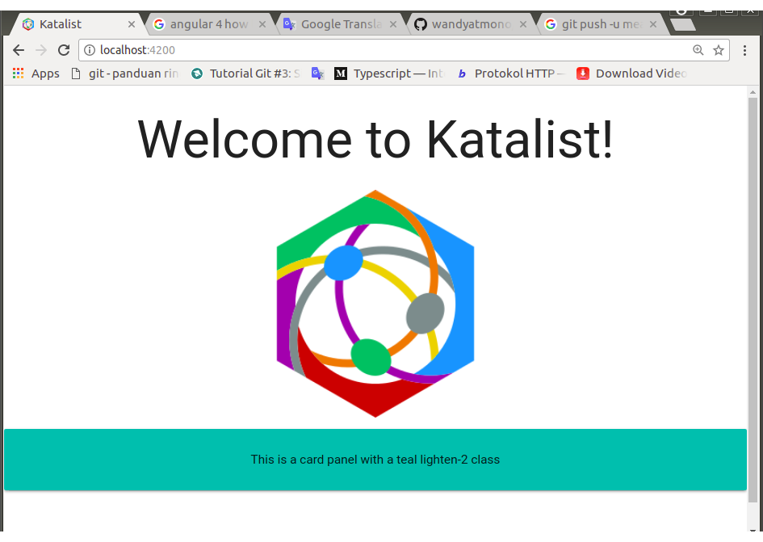
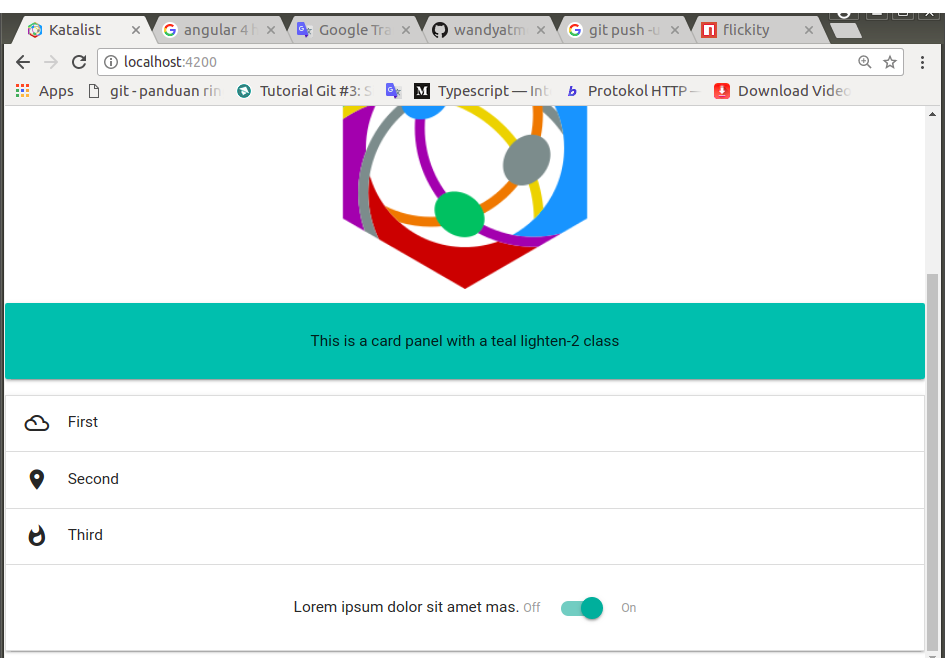
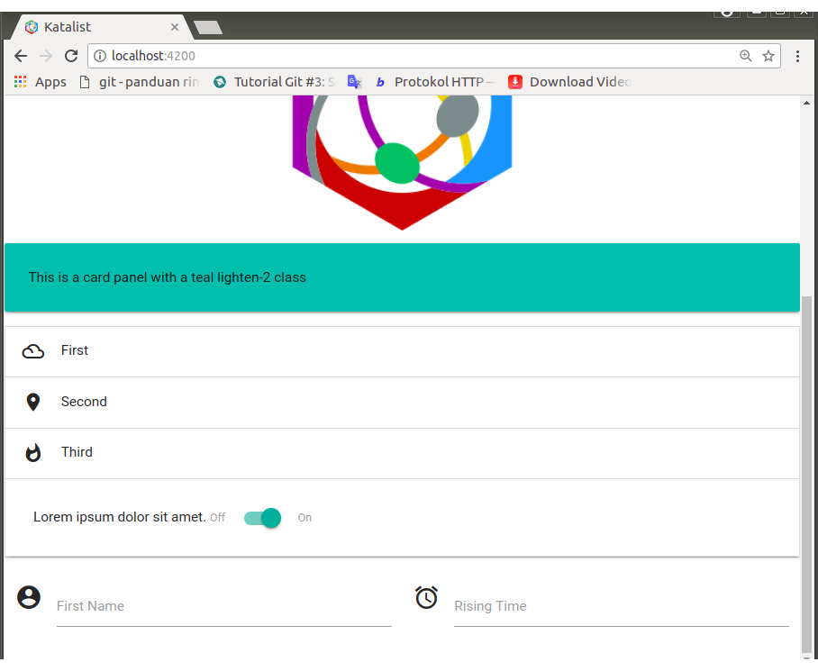
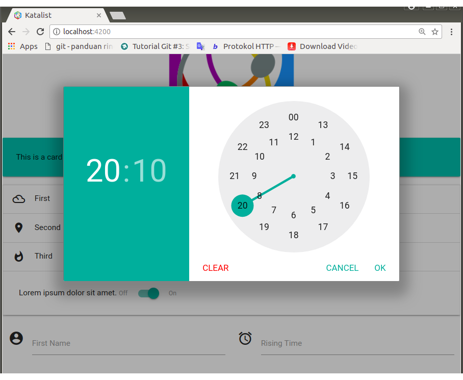
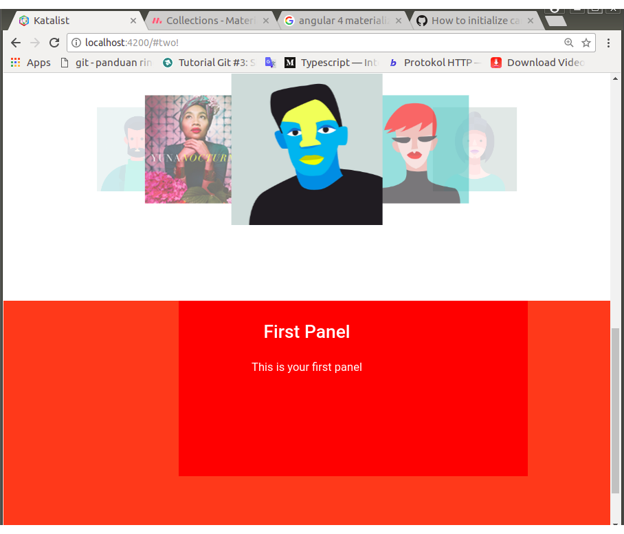

# 0020-materialize-setup


## DESAIN

Katalist harus menerapkan prinsip-prinsip `Google Material Design` sewaktu membangun `UX` (`User Experience`).

Untuk kepentingan tersebut, saya memutuskan untuk menggunakan `CSS framework` yang bernama `MaterializeCSS`  (di dokumentasi akan disebut sebagai `materialize` saja). Walau Materialize memiliki ketergantungan terhadap `jQuery`, `HammerJS` dan `velocity.js`, saya menetapkan framework ini sebagai pilihan saya. Menurut saya, framework ini cukup komprehensif, dokumentasinya lengkap, tidak kaku dan mudah digunakan.

## IMPLEMENTASI I: Instalasi Materialize

1. Saya merujuk ke 

	https://github.com/InfomediaLtd/angular2-materialize
	https://www.npmjs.com/package/angular2-materialize

	Dan demonya di:

	https://infomedialtd.github.io/angular2-materialize

	Situs resmi materialize sendiri ada di:

	http://materializecss.com

2. Install MaterializeCSS and `angular2-materialize` from npm

	`$	npm install materialize-css --save`<br>
	`$	npm install angular2-materialize --save`

3. Butuh jQuery 2.2 dan Hammer.JS sebagai dependensi

	`$	npm install jquery@^3.3.1 --save`<br>
	`$	npm install @types/jquery --save`<br>
	`$	npm install hammerjs --save`<br>
	`$	npm install @types/hammerjs --save`

	Komando ke 2 dan ke 4 di atas digunakan untuk mengenalkan library yang bersangkutan ke typescript.

	> Dalam petunjuk, versi jquery yang diminta adalah ^2.4.1 tetapi saya memutuskan untuk menggantinya dengan jquery@^3.3.1, karena saya pernah mencoba, jika menggunakan jquery versi rendah di angular versi tinggi, ada beberapa swipe events tidak bisa bekerja dengan baik di mobile device.

4. Edit the angular-cli.json

	- Buka bagian `apps` dan cari` styles` array di dalamnya (dengan hanya `styles.css` sebagai nilai default). Saya timpa default value ini dengan value di bawah ini dan file `/style.css` dihapus.

		`"../node_modules/materialize-css/dist/css/materialize.css"`

	- Pergi ke bagian `apps` dan temukan` scripts` array di dalamnya, dan tambahkan baris-baris berikut ke dalam array

		`"../node_modules/jquery/dist/jquery.js",`
		`"../node_modules/hammerjs/hammer.js",`
		`"../node_modules/materialize-css/dist/js/materialize.js"`

5. Tambahkan di bagian atas `root.module.ts`

	```javascript
	import { MaterializeModule } from 'angular2-materialize';
	```

6. Tambahkan `MaterializeModule` di dalam `import` array `@NgModule` dekorator di` root.module.ts`

7. Tambahkan baris ini ke header index.html

	```html
	<link href="http://fonts.googleapis.com/icon?family=Material+Icons" rel="stylesheet">
	```

	Untuk local link:

	```html
	<link rel="stylesheet" href="./assets/fonts/google-2.0.0/material-icons.css">
	```
	> Ke dalam /fonts, masukkan direktori google-2.0.0 dengan menyalinnya dari proyek lain atau men-download-nya dengan bantuan Google Search.

8. Component yang akan menggunakan materialize dan jQuery sebagai dependency-nya, harus berstruktur sebagai berikut:

	```javascript
	import { ..., OnInit } from '@angular/core';
	import { MaterializeModule } from 'angular2-materialize';

	declare let jQuery : any;
	declare let $ : any;

	@Component({
		selector: '...',
		templateUrl: './...html',
		styleUrls: ['./...css']
	})
	export class RootComponent implements OnInit {

		ngOnInit() {
			...
		}
	}
	```

	OnInit diperlukan untuk kepentingan inisialisasi element-element materialize.

	Aplikasikan ke root.component.ts

## IMPLEMENTASI II: Penggunaan

1. Mencoba CSS classes yang disediakan materialize.

	Tambahkan markup berikut ini di bagian akhir root.component template (html)

	```html
	<div class="card-panel teal lighten-2">
		This is a card panel with a teal lighten-2 class
	</div>
	```

	Instalasi berhasil, jika di browser tertampil seperti pada Gambar 0020-1.

    [](./images/0020-1.png)<br>
    <center><i>Gambar 0020-1: Test result screenshot</i></center>

2. Membuat materialize collapsible di root.component

	Hakekatnya, setiap materialize element adalah sebuah component yang siap pakai. Siap digunakan oleh component lain yang membutuhkannya. Ada yang hanya berupa sekelompok style-classes yang dapat digunakan di angular component template, ada components, javascript sets dan beberapa component khusus untuk mobile. 
	
	Yang sudah dilakukan di nomer 1 di atas adalah salah satu contoh penggunaan CSS classes yang didefinisikan oleh materialize. Berikut ini adalah contoh penggunaan materialize component.
	
	Karena hakekatnya adalah sebuah component, materialize collapsible ini akan diadopsi oleh root.component.

	Update root.component template dengan menambahkan markups berikut ini di bagian akhir template tersebut.
	
	```html
	<ul materialize="collapsible" class="collapsible" data-collapsible="accordion">
		<li>
			<div class="collapsible-header">
				<i class="material-icons">filter_drama</i>First
			</div>
			<div class="collapsible-body">
				<p>Lorem ipsum dolor sit amet.</p>
			</div>
		</li>
		<li>
			<div class="collapsible-header">
				<i class="material-icons">place</i>Second
			</div>
			<div class="collapsible-body">
				<p>Lorem ipsum dolor sit amet mas.</p>
			</div>
		</li>
		<li>
			<div class="collapsible-header">
				<i class="material-icons">whatshot</i>Third
			</div>
			<div class="collapsible-body">
				Lorem ipsum dolor sit amet mas.
				<span class="switch">
					<label>
						Off
						<input type="checkbox">
						<span class="lever"></span>
						On
					</label>
				</span>
			</div>
		</li>
	</ul>
	```
	Jika dijalankan, di browser akan ditampilkan:

    [](./images/0020-2.png)<br>
    <center><i>Gambar 0020-2: Screenshot materialize collapsible test</i></center>

	> **Perhatikan!**
	>
	> Pada collapsible body yang ke tiga yang sudah dibuka, isinya tidak hanya teks tetapi ada tambahan berupa materialize switch element. Siap berfungsi untuk menerima aksi user.

3. Apply an empty MaterializeDirective attribute directive for top level components, like forms. Tambahkan markups untuk menampilkan form berikut ini setelah markups untuk collapsible di nomor 2.

		```html
		<form materialize class="col s12">
			<div class="row">
			<div class="input-field col s6">
				<i class="material-icons prefix">account_circle</i>
				<input id="first-name" type="text" class="validate">
				<label for="first-name">First Name</label>
			</div>
			<div class="input-field col s6">
				<i class="material-icons prefix">alarm</i>
				<input id="time-rise" type="text" class="validate">
				<label for="time-rise">Rising Time</label>
			</div>
			</div>
		</form>
		```

	`#time-rise` harus diinisialisasi di controller yang bersangkutan. Yaitu root.component.ts.

	Inisialisasi harus dalam mode implementasi OnInit(), sehingga root.component.ts akan terlihat seperti ini:

	```javascript
	import { Component, OnInit } from '@angular/core';
	import { MaterializeModule } from 'angular2-materialize';

	declare let jQuery : any;
	declare let $ : any;

	@Component({
		selector: 'app-root',
		templateUrl: './root.component.html',
		styleUrls: ['./root.component.css']
	})
	export class RootComponent implements OnInit {
		title = 'Seeds of Katalist project!';

		ngOnInit() {
			$("#time-rise").pickatime({
				default: 'now', // Set default time 'now'
				fromnow: 0, // Set default time to * milliseconds from now (using with default = 0)
				twelvehour: false, // Use AM/PM or 24-hour format
				donetext: 'OK', // Text for done-button
				cleaartext: 'Clear', // Text for clear-button
				canceltext: 'Cancel', // Text for cancel-button
				autoclose: false, // automatic close timepicker
				ampmclickable: true, //make AM PM clickable
				aftershow: function(){} // Function for after opening timepicker
			});
		}
	}
	```
	Ditampilkan di browser:

    [](./images/0020-3.png)<br>
    <center><i>Gambar 0020-3: Screenshot materialize form test</i></center>

    [](./images/0020-4.png)<br>
    <center><i>Gambar 0020-4: Test result screenshot</i></center>

## IMPLEMENTASI III: Menambah Materialize Element

1.	Saya mencoba menambahkan dua tipe carousel di template root.component.

	`root.component.html`

	```html
	<div class="carousel" id="carousel-1">
		<a class="carousel-item" href="#one!">
			
		</a>
		<a class="carousel-item" href="#two!">
			
		</a>
		<a class="carousel-item" href="#three!">
			
		</a>
		<a class="carousel-item" href="#four!">
			
		</a>
		<a class="carousel-item" href="#five!">
			
		</a>
	</div>
	```

	> Note: images, sebelumnya telah saya dipersiapkan.

	```html
	<div materialize="carousel" class="carousel carousel-slider center" id="carousel-2">
		<div class="carousel-fixed-item center">
			<!-- <a class="btn waves-effect white grey-text darken-text-2">button</a> -->
		</div>
		<div class="carousel-item red white-text" href="#one!">
			<h2>First Panel</h2>
			<p class="white-text">This is your first panel</p>
		</div>
		<div class="carousel-item amber white-text" href="#two!">
			<h2>Second Panel</h2>
			<p class="white-text">This is your second panel</p>
		</div>
		<div class="carousel-item green white-text" href="#three!">
			<h2>Third Panel</h2>
			<p class="white-text">This is your third panel</p>
		</div>
		<div class="carousel-item blue white-text" href="#four!">
			<h2>Fourth Panel</h2>
			<p class="white-text">This is your fourth panel</p>
		</div>
	</div>
	```

	> Note:  Styles untuk 'caraosel-element' dapat didefinisikan atu dikastemisasi (dan element-element materialize lainnya). Jadi sebuah carousel bisa digunakan untuk menampilkan option-icons yang berdimensi kecil dan sempit atau digunakan untuk menampilkan images atau space lain dengan dimensi luas.

	Di bagian akhir ngOnInit() root.component.ts`, ditambahkan:

	```javascript
	$('#carousel-1').carousel({});
    $('#carousel-2').carousel({
    	indicators: true
    });
	```

2.	Running test

    [](./images/0020-5.png)<br>
    <center><i>Gambar 0020-5: Test result screenshot</i></center>

